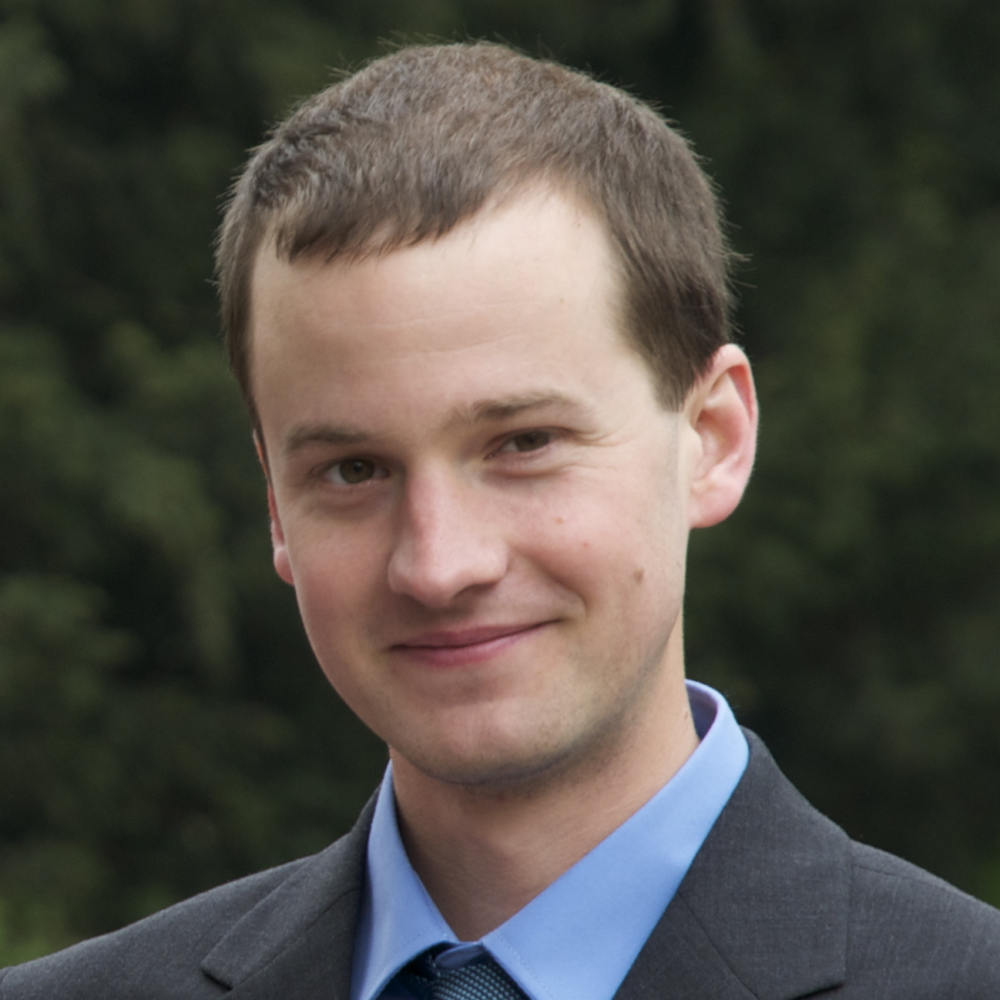

# Authors Biographies

## Andrew Crooks

 Andrew Crooks is an associate professor in computational social science with a joint appointment between the Departments of Computational and Data Sciences and the Geography and GeoInformation Science at George Mason University. His areas of expertise specifically relate to integrating agent-based modelling and geographic information systems (GIS) to explore human behavior. Moreover, his research focuses on exploring and understanding the natural and socio-economic environments specifically urban areas using GIS, spatial analysis, social network analysis, social media, and agent-based modelling methodologies. More information about this work can be seen at: [http://www.gisagents.org](http://www.gisagents.org).

## Nick Malleson
 Nick Malleson is an associate professor in geographical information science at the School of Geography, University of Leeds, and a member of the Centre for Spatial Analysis and Policy (CSAP). His research is interdisciplinary and centers on the development and application of spatiotemporal computational models in the social sciences, with a particular focus on crime simulation and modelling. More recently, he has been conducting research that explores the nature of massive “crowd-sourced” data in the social sciences and related modelling approaches. More information about this work can be seen at: [http://nickmalleson.co.uk/](http://nickmalleson.co.uk/). 

## Ed Manley
Ed Manley is an associate professor at the Centre for Advanced Spatial Analysis (CASA), University College London. His research involves measuring and modelling the individual and collective behaviours that shape urban dynamics, drawing on new streams of data and simulation methods. Ed is particularly interested in advancing data-driven agent-based modelling in order to improve the understanding and prediction of complex social systems. More information about this work can be seen at: [http://www.urbanmovements.co.uk](http://www.urbanmovements.co.uk).

## Alison Heppenstall
 Alison Heppenstall is professor of geocomputation within the School of Geography, University of Leeds (UK) and an associate of Leeds Institute for Data Analytics. She is an expert in the development of spatial agent-based models (ABMs) with a focus on understanding and simulating behavior. Her current interests are concerned with linking ABMs to artificial intelligence and machine learning methodologies, the role of Big Data in creating more robust ABMs, and the relationship of agent-based modelling to social theory. More information can be found at [https://alisonheppenstall.co.uk](https://alisonheppenstall.co.uk). 
